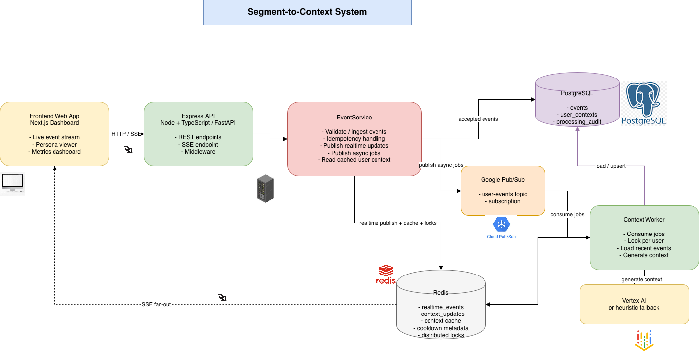

# Segment-to-Context Backend — Complete Guide

This document describes every meaningful file in `backend/`, how data flows through the system, how to run it locally or in Docker, how the original requirements map to code, what is intentionally incomplete, how to use the APIs (including a Postman collection), and how to exercise **Server-Sent Events (SSE)** streaming.

---

## Table of contents

1. [Repository layout](#1-repository-layout)
2. [Architecture and data flow](#2-architecture-and-data-flow)
3. [File-by-file reference](#3-file-by-file-reference)
4. [Step-by-step: bring the backend up smoothly](#4-step-by-step-bring-the-backend-up-smoothly)
5. [What was left out or is still to do](#5-what-was-left-out-or-is-still-to-do)
6. [Requirements traceability (`instruction_backend.md`)](#6-requirements-traceability-instruction_backendmd)
7. [Using the application (overview)](#7-using-the-application-overview)
8. [Postman collection](#8-postman-collection)
9. [Testing streaming ingestion (SSE)](#9-testing-streaming-ingestion-sse)

---

## 1. Repository layout

| Path | Role |
|------|------|
| `instruction_backend.md` | Original product/engineering requirements for this backend. |
| `AI_JOURNEY.md` | Short narrative of how AI tooling was used (deliverable). |
| `BACKEND.md` | **This file** — full technical guide. |
| `package.json` / `package-lock.json` | Dependencies and npm scripts (`dev`, `worker`, `seed`, `build`, `test`). |
| `tsconfig.json` / `tsconfig.build.json` | TypeScript config; build emits `dist/` from `src/` only. |
| `jest.config.cjs` | Jest + coverage thresholds (see [§5](#5-what-was-left-out-or-is-still-to-do)). |
| `docker-compose.yml` | Local stack: Postgres, Redis, Pub/Sub emulator, API, worker. |
| `Dockerfile` | Multi-stage image: `runtime` (production) and `dev` (local compose). |
| `.env.example` | Environment variable template. |
| `diagrams/architecture.drawio` | Editable diagrams.net / draw.io source with overview and flow pages. |
| `infra/terraform/` | Optional GCP IaC (`main.tf`, `variables.tf`). |
| `src/` | Application source (TypeScript). |
| `tests/` | Jest tests and `setup.ts` (default env for tests). |
| `coverage/` | Generated coverage reports (after `npm test`). |

---

## 2. Architecture and data flow

### 2.1 Polished system overview

`draw.io` source: `backend/diagrams/architecture.drawio`
Exported image: `backend/diagrams/segment_architecture.drawio.png`



### 2.2 Flow diagrams

#### 2.2.1 Ingestion and realtime fan-out

```text
+-------------+      +-------------+      +---------------+      +-------------+
|   Client    | ---> | Express API | ---> | EventService  | ---> | PostgreSQL  |
| /producer UI|      | /events     |      | ingestEvent() |      | events      |
+-------------+      +-------------+      +---------------+      +-------------+
                            |                     |
                            |                     |
                            |                     +------------------------------+
                            |                                                    |
                            v                                                    v
                    +---------------+                                    +---------------+
                    | Redis publish |                                    | Pub/Sub       |
                    | realtime_events                                   | user-events    |
                    +-------+-------+                                    +-------+-------+
                            |                                                    |
                            v                                                    v
                    +---------------+                                    +---------------+
                    | SSE endpoint  |                                    | Context Worker|
                    | /events/stream|                                    | async process |
                    +-------+-------+                                    +---------------+
                            |
                            v
                    +---------------+
                    | Frontend live |
                    | EventStream   |
                    +---------------+
```

#### 2.2.2 Context generation pipeline

```text
+---------------+
| Pub/Sub Job   |
| tenant_id     |
| user_id       |
| priority      |
+-------+-------+
        |
        v
+----------------------+
|   Context Worker     |
| startContextWorker() |
+----------+-----------+
           |
           v
+----------------------+
| Redis Per-User Lock  |
| lock:{tenant}:{user} |
+----------+-----------+
           |
           v
+----------------------+
| processUserContext() |
+----------+-----------+
           |
           v
+----------------------+
| PostgreSQL           |
| Load recent events   |
| for tenant + user    |
+----------+-----------+
           |
           v
+-------------------------------+
| LLM Service                   |
|-------------------------------|
| Vertex AI                     |
| or heuristic fallback         |
| + retry/backoff               |
+----------+--------------------+
           |
           v
+----------------------+
| PostgreSQL           |
| UPSERT user_contexts |
+----------+-----------+
           |
           +-------------------+
           |                   |
           v                   v
+----------------------+   +----------------------+
| Redis cache          |   | Redis publish        |
| ctx:{tenant}:{user}  |   | context_updates      |
+----------------------+   +----------------------+
```

#### 2.2.3 API internal structure

```text
+-------------------------------------------------------------+
|                         Express API                         |
+-------------------------------------------------------------+
| Middleware                                                  |
|-------------------------------------------------------------|
| helmet                                                      |
| cors                                                        |
| compression                                                 |
| express.json                                                |
| metricsMiddleware                                           |
| tenantMiddleware                                            |
| apiRateLimiter                                              |
| errorHandler                                                |
+---------------------------+---------------------------------+
                            |
                            v
        +--------------------------------+--------------------------------+
        |                                                                 |
        v                                                                 v
+------------------------+                                   +------------------------+
|      eventRouter       |                                   |      userRouter        |
|------------------------|                                   |------------------------|
| POST /events           |                                   | GET /:userId/events    |
| POST /events/batch     |                                   | GET /:userId/context   |
| GET /events/stream     |                                   +------------------------+
+-----------+------------+
            |
            v
+------------------------+
|      EventService      |
+------------------------+
```

### 2.3 Important nuance (ordering vs instruction)

The written instruction asked for **Pub/Sub as a broker before persisting to the database** so bursts never hit Postgres first. The implemented path is:

1. **Persist first** inside a SQL transaction with `ON CONFLICT (event_id) DO NOTHING` (idempotency and durability).
2. Then **publish** to Redis (realtime) and Pub/Sub (worker queue).

**Rationale:** This ordering guarantees the event row exists before async work, simplifies idempotency, and avoids “message delivered but DB write lost” without an outbox pattern. **Trade-off:** Under extreme overload, Postgres remains the first bottleneck. A stricter reading of “Pub/Sub before DB” would require an **outbox** or **write-behind queue** design (not implemented here). See [§5](#5-what-was-left-out-or-is-still-to-do).

---

## 3. File-by-file reference

### 3.1 Entry points

#### `src/server.ts`

- **Purpose:** Boot the HTTP API.
- **Steps:** `initializeDatabase()` → `getRedis()` → `initializePubSub()` → `createApp()` → `listen(env.port)`.
- **Shutdown:** On `SIGINT` / `SIGTERM`, closes the HTTP server then drains `pool` and Redis.

#### `src/worker.ts`

- **Purpose:** Boot the **Pub/Sub consumer** (context worker).
- **Steps:** Same initialization as API for DB/Redis/Pub/Sub, then `startContextWorker()` which registers a message handler on the configured subscription.
- **Shutdown:** Closes subscription, pool, Redis.

#### `src/app.ts`

- **Purpose:** Pure Express application factory (`createApp()`), used by production and tests.
- **Middleware order:** `helmet` → `cors` (origin `env.frontendUrl`) → `compression` → `express.json(10mb)` → `metricsMiddleware` → `/health` + `/metrics` → **`tenantMiddleware`** → **`apiRateLimiter`** → routers → **`errorHandler`**.
- **Routes:**  
  - `/api/v1` + `/api` mount `eventRouter` (ingest + SSE).  
  - `/api/v1/users` + `/api/users` mount `userRouter` (events list + persona JSON).

---

### 3.2 Configuration

#### `src/config/env.ts`

- Loads `.env` via `dotenv`.
- Central `env` object: `nodeEnv`, `port`, DB, Redis, GCP (project, Pub/Sub names, Vertex location/model), worker tuning, rate limits, `defaultTenantId`.
- **Feature flags:**  
  - `mockPubSub` — `MOCK_PUBSUB=true` skips real Pub/Sub init/publish.  
  - `mockVertex` — `USE_MOCK_VERTEX` defaults to **mock/heuristic** unless explicitly set to `false`.  
  - `bigQueryDataset` — if unset, BigQuery routing is a no-op.

#### `src/config/database.ts`

- **`pool`:** `pg` connection pool sized from `env.db`.
- **`initializeDatabase()`:** Runs idempotent DDL: extension `pgcrypto`, tables `events`, `user_contexts`, `processing_audit`, and indexes optimized for `(tenant_id, user_id, timestamp)`.
- **`withTransaction()`:** `BEGIN` / `COMMIT` / `ROLLBACK` helper used by ingestion.

**Schema highlights**

- `events.event_id UUID UNIQUE` — global idempotency key.
- Indexes `idx_events_tenant_user_time` and `idx_events_tenant_user` — fast per-tenant user reads.
- `user_contexts` has `UNIQUE (tenant_id, user_id)` — one current profile row per tenant user; `context_data` JSONB holds the structured persona payload.

#### `src/config/redis.ts`

- Singleton async Redis client (`getRedis`, `closeRedis`).
- Used for: SSE pub/sub channels, context cache, aggregation cooldown metadata, distributed locks.

---

### 3.3 Types

#### `src/types/express.d.ts`

- Augments Express `Request` with optional `tenantId?: string` set by `tenantMiddleware`.

---

### 3.4 Middleware

#### `src/middleware/tenant.ts`

- Resolves tenant in order: `X-Tenant-ID` header → `tenant_id` query string.
- **Non-production:** if missing, falls back to `env.defaultTenantId` (convenient for local demos; **not** for strict multi-tenant prod).
- **Production:** missing tenant → `401` JSON error.

#### `src/middleware/rateLimit.ts`

---

## Verification answers

### 1. N+1 query risks in this implementation

The current implementation has relatively low classic ORM-style N+1 risk because it does not load nested relational graphs in loops. Most hot-path reads are already coarse-grained:

- Event ingestion writes a single event row in one transaction.
- Context generation loads the latest user events with one query via `listUserEvents(tenantId, userId, 50)`.
- Persona lookup reads one cached context from Redis or one row from `user_contexts`.

The main places where N+1-like behavior could still appear are operational rather than relational:

- If a client requests many users one by one, the frontend would trigger repeated `GET /users/:userId/context` calls, which becomes an application-level N+1 pattern even though each endpoint call is efficient by itself.
- Batch ingestion currently loops through events and calls `svc.ingestEvent()` per event. That is not a relational N+1 query bug, but it does mean one database insert transaction and one Pub/Sub publish per event, which can become a many-small-operations pattern under heavy batches.
- The worker processes one Pub/Sub message per user and runs at least one event read plus one context upsert per job. If many messages for the same user arrive close together, the Redis lock and cooldown reduce duplicate expensive work, but this is still an area where repeated reads can accumulate.

Mitigations already present:

- Recent-event loading is done with a single indexed query on `(tenant_id, user_id, timestamp)`.
- User context reads use Redis first, which prevents repeated database lookups on hot users.
- Per-user Redis locking and cooldown windows prevent multiple workers from recomputing the same context at once in the common case.

Further mitigation if this system grew:

- Add bulk context lookup endpoints for dashboards that need many users at once.
- Replace per-event batch inserts with larger SQL inserts or a true queue-first ingest path.
- Coalesce repeated worker jobs per user using a durable aggregation queue or outbox table.

### 2. Horizontal scaling strategy for API and worker on Google Cloud Run

The API and the worker are intentionally separable processes, which maps well to Cloud Run horizontal scaling.

API scaling strategy:

- Run the Express API as a stateless Cloud Run service.
- Store durable state in Postgres and ephemeral coordination data in Redis, so any API instance can handle any request.
- Let Cloud Run scale out based on incoming HTTP load.
- Use connection pooling carefully because scale-out can otherwise overload Postgres; in production this should sit behind a managed pooler such as PgBouncer or Cloud SQL connectors with tuned pool sizes.
- SSE clients are long-lived connections, so Cloud Run instance concurrency for the API should be tuned lower than a pure REST service. The API can scale horizontally by adding more instances to carry more concurrent SSE streams.

Worker scaling strategy:

- Run the worker as a separate Cloud Run service or Cloud Run job-style long-running consumer, depending on deployment preference.
- Pub/Sub naturally fans work out across worker instances.
- Each worker instance is stateless and coordinates through Redis locks, so multiple instances can safely compete for messages.
- `withPerUserLock()` ensures only one worker normally processes a given `(tenantId, userId)` at a time, which keeps horizontal scale from producing duplicate context generation for the same user.
- Flow control on the Pub/Sub subscription plus `WORKER_CONCURRENCY` bounds per-instance parallelism, while Cloud Run provides instance-level horizontal scaling.

Recommended production guardrails:

- API: set minimum instances for cold-start-sensitive SSE traffic, moderate concurrency, and strict DB pool caps.
- Worker: scale on Pub/Sub backlog, keep instances stateless, and use dead-lettering / retry policy for poison messages.
- Both: use shared Redis and shared Postgres so all instances see the same locks, cache, and source of truth.

### 3. Data consistency if the LLM worker fails mid-process

The system is designed so the event itself is durable before LLM work begins:

1. The API first commits the event into Postgres.
2. Only after that does it publish the async job to Pub/Sub.
3. The worker later reads events from Postgres and writes the generated context back with an UPSERT.

That ordering gives the system an important consistency property: if the LLM worker fails mid-process, no accepted event is lost. The worst case is delayed or missing context generation for that user until retry or a later event.

Current failure behavior:

- If worker code throws before ack, the Pub/Sub message is `nack()`ed for retry up to the configured delivery attempt threshold.
- If the worker keeps failing, the message is eventually acked after repeated attempts in the current implementation, which prevents infinite poison-message loops but can leave the user without an updated context until another event triggers a new job.
- Because `user_contexts` is updated via UPSERT only after context generation succeeds, partial context writes are avoided. There is no “half-written” persona state in the database from a mid-process crash.
- Redis cache invalidation and repopulation happen after the new context is successfully created, so cached context remains either the previous good version or the new good version, not an in-between state.

The main consistency gap is between successful event persistence and eventual context generation:

- The system is event-durable but only eventually consistent for derived user context.
- There is no durable workflow state table marking a job as `pending`, `processing`, `failed`, or `completed`.
- There is no transactional outbox joining the event write and job publication into one atomic handoff.

If stronger guarantees were required, the next improvements would be:

- Add a durable processing status table keyed by tenant and user or by job id.
- Introduce a dead-letter queue for repeated worker failures instead of final ack-and-drop behavior.
- Use an outbox pattern so job publication can be replayed if the API crashes after database commit but before Pub/Sub publish.
- Make context updates idempotent with explicit versioning or event-watermark tracking so retries can be proven safe and observable.

- `express-rate-limit` keyed by `tenantId:ip` to reduce abuse per tenant.

#### `src/middleware/metrics.ts`

- Registers Prometheus default metrics + `http_requests_total` counter when `NODE_ENV !== 'test'`.
- `/metrics` scrapes `client.register`; in tests returns empty body to avoid duplicate metric registration.

#### `src/middleware/errorHandler.ts`

- Logs stack traces.
- Maps `code === 'TENANT_MISMATCH'` to **409** (cross-tenant `event_id` reuse).
- Otherwise **500**.

---

### 3.5 Validation

#### `src/validation/events.ts`

- **Zod** schemas: allowed `event_type` enum, `ingestEventSchema`, `batchSchema` (max 1000 events).
- Exported `IngestEventBody` type for callers.

---

### 3.6 Routes

#### `src/routes/eventRoutes.ts`

| Method | Path (as mounted) | Behavior |
|--------|--------------------|----------|
| `POST` | `/events` | Validates body, assigns `event_id` if omitted, `EventService.ingestEvent`, returns `202` with `accepted` or `duplicate`. |
| `POST` | `/events/batch` | Validates batch, chunks concurrency (25), aggregates accepted/duplicate counts. |
| `GET` | `/events/stream` | **SSE:** subscribes Redis channel `realtime_events`, filters by `tenant_id`, heartbeats every 30s, cleans up on client disconnect. |

#### `src/routes/userRoutes.ts`

| Method | Path | Behavior |
|--------|------|----------|
| `GET` | `/:userId/events` | Lists recent events for tenant+user (`listUserEvents`), `limit` query capped 1–100. |
| `GET` | `/:userId/context` | Returns latest persona JSON via `EventService.getUserContextJson` (Redis cache → Postgres). |

**Route ordering:** `/:userId/events` is registered before `/:userId/context` so Express does not treat `events` as a user id segment by mistake.

---

### 3.7 Repositories (data access)

#### `src/repositories/eventRepository.ts`

- **`insertEvent(client, …)`**  
  - `INSERT … ON CONFLICT (event_id) DO NOTHING RETURNING id`.  
  - If no row returned, loads existing row by `event_id`.  
  - If existing `tenant_id` ≠ request tenant → throws `TENANT_MISMATCH`.  
  - Else returns `{ inserted: false }` (idempotent duplicate for same tenant).
- **`listUserEvents`** / **`countUserEvents`:** Always filter `WHERE tenant_id = $1 AND user_id = $2`.

#### `src/repositories/userContextRepository.ts`

- Defines `UserContextRecord` (persona, segment, scores, arrays, `generated_at`).
- **`upsertUserContext`:** `INSERT … ON CONFLICT (tenant_id, user_id) DO UPDATE` — keeps one row per tenant user.
- **`getLatestUserContext`:** Reads `context_data` JSONB.

---

### 3.8 Services (business logic)

#### `src/services/eventService.ts`

- **`ingestEvent`:** Wraps `insertEvent` in `withTransaction`. On duplicate, **does not** publish to Redis or Pub/Sub (prevents duplicate side effects). On accept, publishes realtime payload, Pub/Sub job payload (with `high_priority` for purchases), and fires BigQuery stub asynchronously.
- **`getUserContextJson`:** Redis cache then DB; populates cache on miss.
- **`refreshContextCache`:** Invalidate + set (used if you extend APIs).

#### `src/services/pubsubService.ts`

- **`initializePubSub`:** Unless mocked, constructs `@google-cloud/pubsub` client, ensures topic + pull subscription exist (with retry backoff policy in subscription options).
- **`publishUserEventMessage`:** `topic.publishMessage({ json })` or no-op when mocked / uninitialized.

#### `src/services/cacheService.ts`

- Thin wrappers over Redis: `realtime_events`, `context_updates`, `ctx:{tenant}:{user}` cache keys, `agg:{tenant}:{user}` cooldown blob, distributed locks `lock:{resource}`.

#### `src/services/llmService.ts`

- **Prompt building** from up to 50 events (`buildPrompt`, `summarizeEvents`).
- **`generateUserContextFromEvents`:**  
  - If `env.mockVertex` → `fallbackContextFromHeuristics` (no GCP call).  
  - Else constructs `VertexAI`, calls `generateContent` inside **`withExponentialBackoff`** with `isVertexRetryable` (429/503/etc.).  
  - Parses JSON from model text; on parse failure logs and falls back to heuristics.

#### `src/services/analyticsRoutingService.ts`

- **Bonus hook:** If `BIGQUERY_DATASET` is set, logs a debug line (stub). No BigQuery client is wired.

---

### 3.9 Workers

#### `src/workers/contextProcessing.ts`

- **`processUserContext`:** Loads ≤50 events; skips if `< WORKER_MIN_EVENTS`; skips if Redis cooldown not elapsed (shorter cooldown for `high_priority`); generates context; upserts DB; refreshes Redis; publishes `context_updates`.
- **`withPerUserLock`:** Redis lock per `tenantId:userId`. If lock not acquired and priority is not high, returns `null` (worker acks without processing — another worker may handle). High priority can proceed without lock (best-effort).

#### `src/workers/contextWorker.ts`

- Subscribes to Pub/Sub messages; JSON payload must include `tenant_id` and `user_id`.
- **Ack/nack policy:** On failure, `nack` if `deliveryAttempt < 5`, else `ack` to stop poison pill infinite retries (DLQ wiring in Terraform is separate; see [§5](#5-what-was-left-out-or-is-still-to-do)).

---

### 3.10 Utilities

#### `src/utils/logger.ts`

- Winston JSON logs to stdout.

#### `src/utils/backoff.ts`

- **`computeBackoffMs`:** Exponential backoff with cap + jitter.
- **`withExponentialBackoff`:** Retry loop with `isRetryable` predicate.
- **`isVertexRetryable`:** String heuristics on common transient Vertex/GCP errors.

---

### 3.11 Scripts

#### `src/scripts/seed.ts`

- Ensures schema, deletes prior rows for `(SEED_TENANT_ID|defaultTenant, SEED_USER_ID|seed_user)`, inserts **60** varied events (enough for worker `WORKER_MIN_EVENTS` default of 5).
- Run: `npm run seed` (requires Postgres reachable with same env as API).

---

### 3.12 Infrastructure and docs

#### `docker-compose.yml`

- **postgres:** `segment_context` database, healthcheck.
- **redis:** AOF persistence, healthcheck.
- **pubsub-emulator:** `gcloud beta emulators pubsub` on `8085`.
- **api / worker:** Build `Dockerfile` `target: dev`, mount `src/`, anonymous volume for `node_modules`, wire `PUBSUB_EMULATOR_HOST`, set `MOCK_PUBSUB=false` for real emulator usage inside compose.

#### `Dockerfile`

- **`deps` / `build`:** `npm install`, `npm run build` → `dist/`.
- **`runtime`:** production `node dist/server.js`.
- **`dev`:** full devDependencies for `tsx` hot run in compose.

#### `infra/terraform/main.tf` + `variables.tf`

- Pub/Sub topic + subscription with dead-letter policy reference.
- Cloud Run services for API and worker (images passed as variables).
- Service accounts + IAM for Pub/Sub publish/subscribe and Vertex user.
- **Note:** This is a **snippet/skeleton** — it does not provision Cloud SQL, VPC peering, secrets, or push subscriptions wired to an HTTP endpoint. Treat as a starting point.

#### `tests/setup.ts`

- Forces `NODE_ENV=test`, enables Pub/Sub + Vertex mocks by default, sets DB/Redis defaults, sets `SKIP_INTEGRATION` default **`true`** so CI laptops without Docker do not hang on Postgres connection timeouts.

#### `tests/*.test.ts` / `*.integration.test.ts`

- Unit tests for validation, backoff, LLM helpers, repositories, services, HTTP routes (often with Jest mocks), and optional integration tests when `SKIP_INTEGRATION=false` and databases are up.

---

## 4. Step-by-step: bring the backend up smoothly

### Option A — Local processes (recommended for development)

1. **Install Node 18+** and npm.
2. **Start Postgres and Redis** (Docker or native). Defaults: host `localhost`, port `5432`, db `segment_context`, user/password `postgres`/`password` (see `.env.example`).
3. **Copy environment file:**  
   `cp .env.example .env` and edit values.
4. **Pub/Sub emulator (optional but needed for real async worker locally):**  
   - Install Google Cloud SDK **or** run only infra from compose:  
     `docker compose up -d postgres redis pubsub-emulator`  
   - Set `PUBSUB_EMULATOR_HOST=localhost:8085` and `GCP_PROJECT_ID=test-project` in `.env`.
5. **Install dependencies:**  
   `cd backend && npm install`
6. **Run API:**  
   `npm run dev`  
   - On startup, API ensures DB schema and initializes Pub/Sub topic/subscription (unless `MOCK_PUBSUB=true`).
7. **Run worker (second terminal):**  
   `npm run worker`
8. **Seed demo data (optional):**  
   `npm run seed`  
   - Creates 60 events for `seed_user` under `DEFAULT_TENANT_ID` (or `SEED_TENANT_ID` / `SEED_USER_ID` overrides).

**Health check:** `GET http://localhost:3000/health`

---

### Option B — Full stack in Docker

1. From `backend/`: `docker compose up --build`
2. Wait for Postgres + Redis healthy; Pub/Sub emulator starts with a trivial healthcheck.
3. API on **3000**, worker consumes emulator traffic.

**Note:** First `docker compose` build runs `npm install` inside the image; bind-mounting `./src` preserves hot reload via `tsx watch` in the `dev` target.

---

### Option C — Production-like (GCP)

1. Build and push images for API and worker (`Dockerfile` `runtime` stage or CI pipeline).
2. Provision **Cloud SQL for PostgreSQL**, **Memorystore/Redis** (or ElastiCache equivalent), **Pub/Sub** topic + subscription, **Vertex AI** enabled APIs, and service accounts.
3. Apply Terraform **after** filling gaps (DB URL, secrets, VPC connector, etc.) or use your org’s preferred IaC.
4. Set `USE_MOCK_VERTEX=false`, provide Application Default Credentials or `GCP_KEY_FILE`, tune `VERTEX_MODEL`.

---

## 5. What was left out or is still to do

| Item | Status |
|------|--------|
| **Strict “Pub/Sub before DB”** | Not implemented; current design is **DB first**, then Pub/Sub + Redis. Outbox / staged writes would be needed for literal compliance. |
| **Cloud Tasks / push subscription worker** | Worker is **Pub/Sub pull** from Node, not Cloud Tasks, not HTTP push to Cloud Run. Terraform in repo referenced push in an older reference; current `infra/terraform` aligns with services but still omits full push wiring. |
| **BigQuery** | **Stub only** (`analyticsRoutingService.ts`). No dataset/table loader. |
| **`processing_audit` table** | Created in DDL but **not written** by worker (placeholder for future idempotency/audit per message). |
| **85% global test coverage / full integration suite** | Jest `coverageThreshold` is set to **85%** lines/statements, but achieving it reliably may require running against live Postgres/Redis and/or adjusting thresholds. `SKIP_INTEGRATION` defaults to **true** so tests do not block on local DB. **You asked to skip testing for now** — treat tests as **work in progress** until you run `npm test` in CI with services. |
| **Row-Level Security (RLS) in Postgres** | Tenant isolation is enforced in **application SQL** (always `tenant_id` in `WHERE`), not database-enforced RLS policies. |
| **Dead letter topic auto-creation in emulator init** | Subscription retry/DLQ may require topics to exist depending on emulator version; verify when enabling DLQ locally. |
| **SSE + browser `EventSource` headers** | Browsers cannot set `X-Tenant-ID` on `EventSource`. Use **`?tenant_id=`** or rely on non-production default tenant (see [§9](#9-testing-streaming-ingestion-sse)). |

---

## 6. Requirements traceability (`instruction_backend.md`)

| Requirement | How it is met | Primary code locations |
|-------------|---------------|-------------------------|
| **Express + TypeScript** | Entire `src/` tree is TS; Express app in `app.ts`, boot in `server.ts`. | `src/app.ts`, `src/server.ts` |
| **High-throughput ingestion + burst strategy** | JSON body size limit, compression, per-tenant rate limit, connection pooling, batch endpoint with chunked `Promise.all`, Pub/Sub fan-out for async processing. | `src/app.ts`, `src/middleware/rateLimit.ts`, `src/routes/eventRoutes.ts`, `src/services/pubsubService.ts` |
| **Pub/Sub as message broker** | `publishUserEventMessage` after successful insert; worker subscribes. | `src/services/eventService.ts`, `src/services/pubsubService.ts`, `src/workers/contextWorker.ts` |
| **Data persistence (Postgres) + fast retrieval** | `events` + composite indexes on `(tenant_id, user_id, timestamp)`. | `src/config/database.ts`, `src/repositories/eventRepository.ts` |
| **Bonus: BigQuery** | Stub hook when `BIGQUERY_DATASET` set. | `src/services/analyticsRoutingService.ts` |
| **Context worker (async)** | Separate `worker.ts` process; Pub/Sub-driven. | `src/worker.ts`, `src/workers/*` |
| **Aggregate last 50 events** | `listUserEvents(..., 50)` in processing. | `src/workers/contextProcessing.ts`, `src/repositories/eventRepository.ts` |
| **Vertex AI (Gemini)** | `@google-cloud/vertexai` when `USE_MOCK_VERTEX=false`. | `src/services/llmService.ts` |
| **Structured JSON profile** | `UserContextRecord` + normalization. | `src/repositories/userContextRepository.ts`, `src/services/llmService.ts` |
| **Exponential backoff on LLM** | `withExponentialBackoff` + `isVertexRetryable`. | `src/utils/backoff.ts`, `src/services/llmService.ts` |
| **Strict idempotency (`event_id`)** | DB unique constraint + `ON CONFLICT DO NOTHING` + no side effects on duplicate path. | `src/repositories/eventRepository.ts`, `src/services/eventService.ts` |
| **Tenant isolation** | Tenant middleware; every query filters `tenant_id`; cross-tenant `event_id` → **409**. | `src/middleware/tenant.ts`, `src/repositories/*.ts`, `src/middleware/errorHandler.ts` |
| **IaC** | `docker-compose.yml` + `infra/terraform`. | repo root `backend/` |
| **AI_JOURNEY.md** | Present. | `AI_JOURNEY.md` |
| **Testing / seed / stream demo** | `tests/*`, `npm run seed`, SSE route. | `tests/`, `src/scripts/seed.ts`, `src/routes/eventRoutes.ts` |

---

## 7. Using the application (overview)

1. **Ingest events** with `POST /api/v1/events` (or `/api/events`) including `X-Tenant-ID` (production) or relying on default tenant in dev.
2. **Batch ingest** with `POST /api/v1/events/batch` for up to 1000 events per request.
3. **Worker** consumes Pub/Sub messages and rebuilds persona JSON when enough events exist; results land in `user_contexts` and Redis.
4. **Fetch persona** via `GET /api/v1/users/{userId}/context`.
5. **List raw events** via `GET /api/v1/users/{userId}/events?limit=50` (useful after `npm run seed` or your own inserts).
6. **Watch live ingests** via SSE `GET /api/v1/events/stream` (or `/api/events/stream`) — each accepted ingest publishes to Redis.

**Correlation:** Responses include `event_id` (client-supplied or server-generated UUID). Store it client-side if you need to correlate duplicates (`status: duplicate`).

---

## 8. Postman collection

Import the JSON below as a **Postman Collection v2.1** (`Import` → `Raw text`).

Variables:

- `baseUrl` → `http://localhost:3000`
- `tenantId` → e.g. `dev-tenant` (must match seeded data if you use seed defaults)
- `userId` → e.g. `seed_user`

```json
{
  "info": {
    "name": "Segment-to-Context Backend",
    "schema": "https://schema.getpostman.com/json/collection/v2.1.0/collection.json"
  },
  "variable": [
    { "key": "baseUrl", "value": "http://localhost:3000" },
    { "key": "tenantId", "value": "dev-tenant" },
    { "key": "userId", "value": "seed_user" }
  ],
  "item": [
    {
      "name": "Health",
      "request": {
        "method": "GET",
        "header": [],
        "url": "{{baseUrl}}/health"
      }
    },
    {
      "name": "Metrics",
      "request": {
        "method": "GET",
        "header": [],
        "url": "{{baseUrl}}/metrics"
      }
    },
    {
      "name": "Ingest single event",
      "request": {
        "method": "POST",
        "header": [
          { "key": "Content-Type", "value": "application/json" },
          { "key": "X-Tenant-ID", "value": "{{tenantId}}" }
        ],
        "body": {
          "mode": "raw",
          "raw": "{\n  \"user_id\": \"{{userId}}\",\n  \"event_type\": \"page_view\",\n  \"properties\": { \"path\": \"/checkout\" }\n}"
        },
        "url": "{{baseUrl}}/api/v1/events"
      }
    },
    {
      "name": "Ingest batch",
      "request": {
        "method": "POST",
        "header": [
          { "key": "Content-Type", "value": "application/json" },
          { "key": "X-Tenant-ID", "value": "{{tenantId}}" }
        ],
        "body": {
          "mode": "raw",
          "raw": "{\n  \"events\": [\n    {\n      \"user_id\": \"{{userId}}\",\n      \"event_type\": \"button_click\",\n      \"properties\": { \"button\": \"add_to_cart\" }\n    },\n    {\n      \"user_id\": \"{{userId}}\",\n      \"event_type\": \"purchase\",\n      \"properties\": { \"amount\": 49.99, \"sku\": \"SKU-1\" }\n    }\n  ]\n}"
        },
        "url": "{{baseUrl}}/api/v1/events/batch"
      }
    },
    {
      "name": "List user events",
      "request": {
        "method": "GET",
        "header": [{ "key": "X-Tenant-ID", "value": "{{tenantId}}" }],
        "url": "{{baseUrl}}/api/v1/users/{{userId}}/events?limit=50"
      }
    },
    {
      "name": "Get user context (persona)",
      "request": {
        "method": "GET",
        "header": [{ "key": "X-Tenant-ID", "value": "{{tenantId}}" }],
        "url": "{{baseUrl}}/api/v1/users/{{userId}}/context"
      }
    },
    {
      "name": "Event stream (Open in browser or curl)",
      "request": {
        "method": "GET",
        "header": [],
        "url": "{{baseUrl}}/api/v1/events/stream?tenant_id={{tenantId}}"
      }
    }
  ]
}
```

**Postman limitation:** Its request runner is not ideal for long-lived SSE. Use **curl** or a **browser** for streaming (see next section).

---

## 9. Testing streaming ingestion (SSE)

### 9.1 Why query `tenant_id`?

`EventSource` in browsers **cannot** send custom headers. Production mode requires an explicit tenant, so the stream endpoint also accepts:

`GET /api/v1/events/stream?tenant_id=YOUR_TENANT`

(`tenantMiddleware` merges header or query.)

In **non-production**, if you omit both, the API falls back to `DEFAULT_TENANT_ID` from `.env`.

### 9.2 Terminal walkthrough (curl)

**Terminal A — start API + worker + infra** (per [§4](#4-step-by-step-bring-the-backend-up-smoothly)).

**Terminal B — open SSE client**

```bash
curl -N "http://localhost:3000/api/v1/events/stream?tenant_id=dev-tenant"
```

You should see periodic `: heartbeat` lines.

**Terminal C — ingest an event**

```bash
curl -sS -X POST "http://localhost:3000/api/v1/events" \
  -H "Content-Type: application/json" \
  -H "X-Tenant-ID: dev-tenant" \
  -d '{"user_id":"demo_user","event_type":"purchase","properties":{"amount":19.99}}'
```

**Terminal B** should receive a `data: {...}` line containing JSON with fields like `tenant_id`, `user_id`, `event_type`, `timestamp`, `properties`.

### 9.3 Browser walkthrough

1. Open DevTools → **Network**.
2. Navigate to (example):  
   `http://localhost:3000/api/v1/events/stream?tenant_id=dev-tenant`  
   (Or use a tiny HTML page with `new EventSource('/api/v1/events/stream?tenant_id=dev-tenant')` proxied to the API origin.)
3. Fire `POST /api/v1/events` from Postman/curl as above.
4. Observe **EventStream** frames in Network or your `onmessage` handler.

### 9.4 What you should see after seed + worker

1. `npm run seed` (Postgres up).
2. Ensure `MOCK_PUBSUB=false` and worker running so messages process.
3. `GET /api/v1/users/seed_user/context` should eventually return JSON (may remain `404` until enough events + worker cooldown rules satisfied — if stuck `404`, ingest a few more live events or temporarily lower `WORKER_MIN_EVENTS` / cooldown in `.env`).

---

## Quick reference — npm scripts

| Script | Meaning |
|--------|---------|
| `npm run dev` | API with `tsx watch`. |
| `npm run worker` | Pub/Sub consumer worker. |
| `npm run seed` | Seed 60 events for demo user/tenant. |
| `npm run build` / `npm start` | Compile to `dist/` and run compiled API. |
| `npm test` | Jest + coverage (when you re-enable testing). |

---

*End of `BACKEND.md`.*
